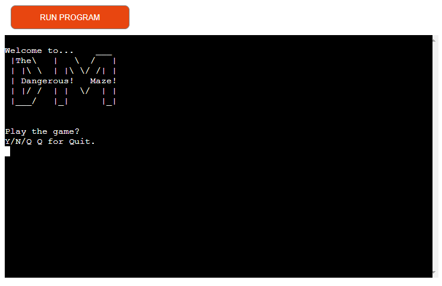
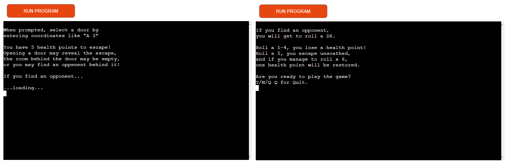
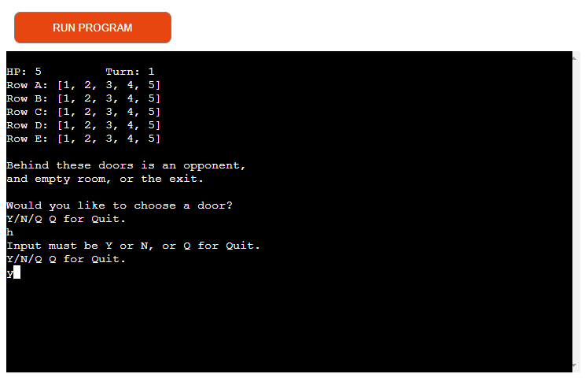
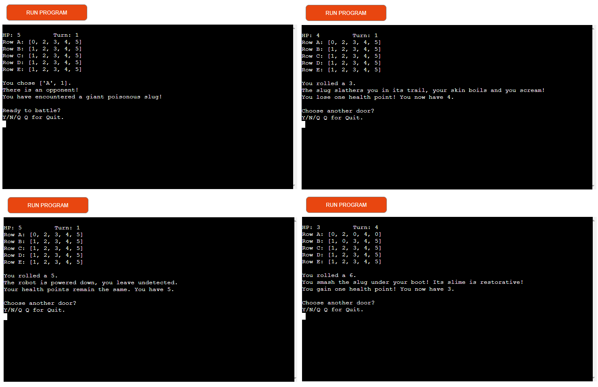
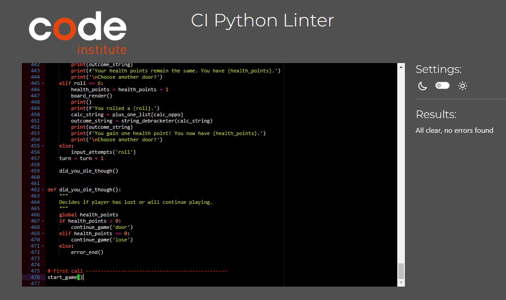

# The Dangerous Maze

Porfolio Project 3, Python Essentials.

## Program links

- [Github repository](https://github.com/WSMorrison/The_Dangerous_Maze)
- [Heroku Overview](https://dashboard.heroku.com/apps/the-dangerous-maze)
- [Deployed app](https://the-dangerous-maze.herokuapp.com/)

## Contents
*Table of contents available as part of GitHub README.md header*

# Rationale

The Portfolio Project 3 is a terminal based Python project. It was decided that this format was perfect for a program similar to the text-based, dice-rolling, role-playing adventure games from the developer's childhood before GUI were common. 

The purpose of this project is to display the developer's ability to program a Command Line Interface based program. The game will play with simple keyboard based commands, allowing the user to select whether they want to continue or quit, and the user can select positions on a grid that may trigger an opponent or not, and the user will benefit from a simulated dice roll that will decide the outcome of any opponent encounter. The encounters can result in the loss or gain of a health point, and if the user's health points run out before they find the exit they lose.

The program will exhibit understanding of the Python pogramming language, functions, nested functions, data type, nested data types, methods, object oriented programming, API usage, and deployment strategies. It will also incorporate defensive design, well organized code, and easily readable and understandable user interface.

# User Experience

## Project Targets

- The game will be able to be played on a computer browser.
- The game will accept user input.
- The game will react to user inputs, rejecting bad or duplicate inputs in a pleaseing way.
- The game will progress in a logical way, and indicate previous guesses.
- The game will be of appropriate difficulty and duration.
- The game will have engaging, "adventure game" copy.

## Project Outcome

The outcome of this project will be a playable, terminal based, command line interface game describing an adventure situation where the user encounters monsters as they try to escape a maze.

## Design

Care was taken to make the game input locations consistent as the game advances. The game uses a function to clear the screen and rebuild the displayed gameboard between user inputs, keeping the terminal tidy and readable. The game was intentionally kept with black text on the black terminal background as an homage to the early games of this type it was inspired by. 

# Technology Implementation

## Language

The program is written in the Python programming language. [Python](https://www.python.org/)

## Technology

- The program was built on the Code Institute Python Essentials Template. Available on request.
- The program uses Google Sheets for spreadsheet hosting. [Google Sheets](https://www.google.com/sheets/about/)
- The spreadsheets are accessed using a credentials and API provided by Google Sheets.
- The spreadsheets are interpreted for Python using Gspread. [gspread](https://docs.gspread.org/en/v5.7.0/)
- Python imports modules from the time and math libraries, and the user's operating system.

## Deployment

- Code was written and version control maintained in GitHub. [Github](https://github.com/)
- The game was deployed as an app using Heroku. [Heroku](https://www.heroku.com/)

When the code was deployment ready, it was deployed in Heroku by following these steps as outlined in the Code Institute Love Sandwiches Walkthrough Project, Deployment, Deploying our Project Part 1 and Part 2 lessons:

- The run.py file had to have the input() methods modified with a linebreak to work with the Code Institute mock terminal being run by Heroku.
- A requirements.txt file was made to give Heroku the dependencies required by the program. This was done by issuing the command "pip3 freeze > requirements.txt" in the Gitpod terminal.
- In the Heroku dashboard, a new app was created.
- In the new app's page, the settings tab was selected, and the following settings were set:
    - A config var was set as CREDS for the key field, and the creds.json file contents copied and pasted into the value field.
    - A config var was set as PORT for the key field, and 8000 for the value field.
    - heroku/python Buildpack was added to the required buildpacks.
    - heroku/nodejs Buildpack was added to the required buildpacks. The buildpacks must be set in this order.
- In the deploy tab of the app's page, the following selections were made:
    - The app was connected to the developer's appropriate Github repository.
    - Automatic deploys were enabled.
    - Deploy Branch was selected for the initial deployment.
- When Heroku successfully deployed the App, the deployment was checked and tested.

# Features

- The game shows a pair of screens that explain the game, using a "...loading..." message to give the user time to read the rules, and time for the game to get the color copy from Google Sheets.

- The game displays a game board showing rows of doors and selectable positions on each row.
- Health points are displayed throughout gameplay and remain accurate as gameplay advances.
- A turn counter maintains a count of user turns and indicates how long they have lasted.
- The game changes positions to a 0 instead of a position number to indicate that it was selected.
- The code defends against selecting a previously selected door to avoid wasted attempts or errors.
- The code defends against bad, empty, or duplicate inputs during gameplay. The input *will* accept lowercase inputs, and will even accept multicharacter strings starting with a Y, N or Q (like yes, no, or quit) correcting for length and case.

- When the user is asked to choose a door, they can select Y/N/Q. If the user selects N for "No," the following input asks if the user is sure, which by structure reverses the Y/N choices from the standard outcomes in the rest of the game. This was questioned by a minority of testers, and left this way intentionally by the developer.
- There is a functionality that allows the user to input N when asked to fight. This allows the user to not fight the opponent. A simulated D6 is rolled to determine the outcome.
    - A roll of 3-6 allows the user to escape without losing a health point.
    - A roll of 2 will cost the user 1 health point.
    - If a 1 is rolled, the user will lose two health points.
- The game accesses a developer expandable list of opponents for the color copy during gameplay.
- There are several opponents to encounter, and three outcomes based on a random integer 1-6 being generated by the code, or "rolled."
    - A roll of 1-4 take a health point away from the user.
    - A roll of 5 makes no change to the health points.
    - A roll of 6 restores one health point to the user.

- The code tracks which opponents have been called and excludes them from duplicate selection.
- There is a system of hints that will give the user a hint about which row or position the exit door is not in after each third turn. The function tracks which hints were given so there will be no duplicate hints.
- The code clears the screen and rebuilds the game board at each input to maintain a clean look.
- If the user loese the game, the game continues to show the result of the encounter before continuing to a user lose message.
- The code clears the screen and rebuilds the board before showing a user win or user lose message.
- If the game ends resulting from the user qutting or Ning out of the game, the program exits.
- If the game ends by the user winning or losing the game, the game invites the user to play again.

# Testing

The game was tested in Gitpod during development, to maintain continuity of functionality and to check that each added development worked properly. 

There is a diagnostic function in the code, the call for it commented out. It allows the developer and subsequent developers to view the user selected door position, the winning door position, and all previously selected positions. With this function enabled, a developer can see what's going on and quickly test changes in the code by accessing or avoiding the winning position. This code is intentionally left in, because it may be useful for assessors as well!

After deployment, the app was shared with friends, family, and Code Institute classmates to test the code. The game was remarked to be frustrating more than difficult, so two new functions were added to help the user play the game more efficiently. 
 - The first added function was a hint that gives the user a row or position the exit door is not in after every third turn. 
 - A second functionality gives the user the opportunity to not battle the opponent, allowing them to choose N giving them a 2/3 chance of losing no health points, but the possibilty of losing up to two. This also comes with copy to reflect the decision based on which opponent they discovered behind the door.

As part of rigorous testing, data analyst Jay Tarbell was retained to simulate the outcomes of the game. Simulations were run with all relevant use decisions set to "fight," and again as all relevant decisions set to "flee." This was done to check that both options result in similar outcomes, and neither gives the user an appreciable advantage. These simulations were also run to check the parity between the user winning or losing the game. After 20,000 simulated plays of each option, the "flee" only option resulted in with a nearly perfect 50% chance of the user winning and the "fight" option resting around a 46% chance of the user winning. This indicates fairly even odds for user play before the added benefit of hints, rooms without opponents, and user strategy in picking doors. The simulation also resulted in an average of 12 turns per game, for both decisions. These were considered by the developer as appropriate for an interesting and engaging game to get varying results and repeat plays.

Code was copy and pasted into the [Code Institute Python Linter](https://pep8ci.herokuapp.com/), and returned no errors.

Some bugs were exposed during initial development and during deployed testing, most were fixed.

## Bugs

During predeployment development, a bug was found that caused the game_over_lose() function to print a line displaying "You lose" once for every time the dice_roll() function had been called during gameplay. Troubleshooting found that developer had used an if statment instead of an elif statement for the losing condition, which apparently held all of the instances of the game_over_lose() function until it was finally called. The if statement was replaced with an elif statement, and the code worked properly, only printing the losing message once. (Some of these functions have been refactored or changed, so this may not seem directly applicable to code as it's written now, but the logic and the error would have remained if not fixed.)

A bug in the initial design of the door_row() and door_pos() functions was revealed in predeployment testing. When the user gave a bad input on the first attempt for the row or position, the functions would return None even if the user ultimately submitted a good input. The problem was that the defensive part of the function called itself again, so the value returned did not get to the original calling location. The issue was fixed by passing around a global variable instead of passing the function's returned output directly to the position it was called. This allowed the function to write the user's good input to the variable and that information be accessed elsewhere in the program.

Before the code was deployed, the Python code was linked to Google Sheets spreadsheets for the color copy. During the initial build of this functionality, the code was accessed and returned directly into an f'string literal. This caused the string returned with square brackets and single quotes surrounding the imported text instead of a seamless string (see screenshot). Classmate [Adam Boczek](https://github.com/aboczek) suggested a solution described by Borislav Hadzhiev on his [webpage](https://bobbyhadz.com/blog/python-remove-square-brackets-from-list). A new string_debracketer() function was developed using similar code, and printing the returned string to the f'string literal displayed the text properly.

After deployment, it was found that the game_over_lose() function prevents the color copy for the final opponent that takes you last health point away from displaying. An additional call for and change to the continue_game() were made to improve the function timing and show the result of the encounter before showing the user that the game is lost.

After deoloyment and testing, an additional function was added that would give the user a hint after every third turn. This function would work properly most of the time, but occasionally would crash the app. The code randomly selects a row or position that aren't included in the doordinates by determining the length of the list or remaining values, and calculating a random.randint() of a range of that length. Troubleshooting found that while the range started at 0 index, the range could extend to an index of 1 past the end of the list because it wasn't adjusted to match the position indexes starting at 0. Added a -1 to the range calculation in the code, and the function works properly and consistently.

After deployment, during testing the give_hint() function was found to have a bug that didn't exclude previous hints from being suggested to the user. Troubleshooting found that developer stupidly set the initial hint_row and hint_pos list values inside the give_hint() function, so they were reset every time the function was called. Moved the initial value setting to the first_render() function so they would be set once and changed as game play continued.

## Unfixed bugs

There is a bug where the global attempts variable resets between most functions, but not between the door_row() and door_pos() functions. This means that the user has a combined 5 attempts to input good values for the door row and the door position.

# Credits

- Code Institute Python Essentials lessons for the bulk of my understanding of how Python works. [Code Institute](https://codeinstitute.net/ie/)
- Code Institute instructor Simen Daehlin for almost everything else. [Simen Daehlin Github](https://github.com/Eventyret)
- Code Institute mentor Jubrile Akolade provided guidance on where to focus time building project and an almost infinite amount of other support.
- All of my Code Institute UCD July 2022 cohort, who have been available to answer questions through slack.
- Code Institute tutors accessed through the Code Institute LMS have been helpful with understanding various concepts during instruction.
- Code to import Googles sheets is used and implemented as shown and explained in Code Institute lessons, specifically the "Love Sandwiches Walkthrough Project, Getting Set Up, Connecting to our API with Python lesson." On request.
- The results of the Jay Tarbell generated gameplay simulations can be found [here](https://docs.google.com/spreadsheets/d/1180jEkpa869zkL5wgG-v5YNBlNztwwafCtyt_MA6_QA/edit?usp=sharing)
- The code was validated using the Code Institute Python Linter. [CI Python Linter](https://pep8ci.herokuapp.com/)
- W3Schools for help with some data structures and methods. [W3Schools](https://www.w3schools.com/python/)
- Information on clearing the screens on different operating systems found [here.](https://www.geeksforgeeks.org/clear-screen-python/)
- Information and ideas that inspired using ASCII assigments and the random.randint() method in a specific range to return a random letter was found [here.](https://stackoverflow.com/questions/2823316/generate-a-random-letter-in-python)
- Information on using the .join() method to creat strings free of brackets and single quotes for use as part of string literals was found [here.](https://bobbyhadz.com/blog/python-remove-square-brackets-from-list)

For educational purposes only.